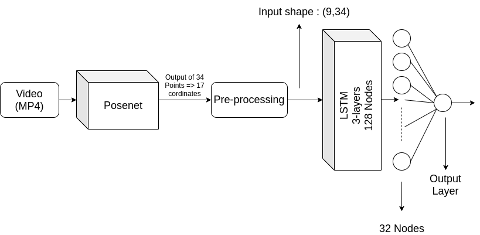

# Lite Model For Human Activity Recognition (HAR)

[](https://github.com/ItsSiddharth/context_search/blob/master/LICENSE)   [](http://makeapullrequest.com) 

## Content 
1. [Overview](#overview)
2. [Architecture](#architecture)
3. [Usage](#usage)

## Overview
Most of the HAR models out there are just too heavy and cannot be deployed on cheap hardware like Raspberry Pi, Jetson Nano etc. Even in Laptops the inference timing is very high and causes a lot of lags.
This model efficiently solves this problem,
```
A Binary HAR classifier that can be trained and deployed in less than 10 lines of code.
```

## Architecture
As this is a time series problem using an LSTM was an apparent choice.
> The LSTM had to be taught the relative motion of how the body joints move for vertain action.

* Dataset Used : <a href="https://deepmind.com/research/open-source/kinetics">Kinetic400</a>

### Preprocessing
In preprocessing I have infered <a href="https://www.tensorflow.org/lite/models/pose_estimation/overview" >Posenet</a> (TF-lite model) using tf.Interpreter().
1. Posenet returns a **HeatMap** and an **OffsetMap**.
2. Using this we extract the location of the 17 Keypoints/Body Joints that posenet detects.
3. If a certain joint is not in frame it is assigned [0,0].
4. From every video we sample 9 frames that are equally spaced.
5. Now each frame of the 9 frames in each video will contain 17 lists of [x,y].
6. This implies 34 points in each frame.
7. Using the path to the dataset we can make a .csv file which is essentially our training data.


### Model
1. There are 'x' no of videos each having 9 frames which in turn have 34 points.
2. So input shape for first LSTM becomes (9,34).
3. The model is a 3 layer LSTM with 128 nodes each, along with Dropouts of 0.2 and 0.1 and a batch normalization.
4. Which is followed by a Dense Layer of 32 nodes and an Output Layer of 1 node.


### Inference
1. During inference we use Posenet again for preprocessing and pandas takes care of the rest.
2. Load in the model and pass on the preprocessed data into the model.
3. The model will make a binary classification based on the 2 labels you trained it on.

## Usage
### Infering the example models
1. Use the script ```testing_model.py```.
2. There are 2 models in the repo ```mwrestling_vs_guitar.model``` and ```guitar_vs_yoga.model```.
3. In the below line insert the name of the model you want to infer.
```
>> model = tf.keras.models.load_model('<model_name>')
```
4. Once you have the video offline (or) a stack of 9 frames in your live inference. Pass it on to the function ```preprocess_video```. Please have it ready in **mp4 format**.
```
>> X_test = preprocess_video('< Path to Video >')
``` 
5. Once these 2 line of the code are edited. You can run the code an Obtain the prediction.


### Training custon classifier.
1. Use the script ```train.py```.
* **NOTE** : Ensure all training examples are 10 seconds long. i.e., use kinetics dataset.
2. Now using the function ```generate_training_data``` we can essentially make out training data.
The function takes 2 parameters **Path to videos** and **Name of the csv you want to generate**
```
>> generate_training_data('<Path_to_folder_containing_videos>', '<name_of_csv>')
```
3. Now that both the csv's are generated. Use the ```preprocess_csv``` function to get your training_array.
The function takes 2 parameters **Path to CSV** and **No of samples in validation set**.
```
>> X_action2_train, X_action2_test =  preprocessing_csv('<name_of_csv>', no_of_elements_in_validation_set)
```
4. This returns the test and training split.
5. Now use the ```get_final_data_for_model```.
```
>> X_train, X_test, Y_train, Y_test = get_final_data_for_model(X_action2_train, X_action2_test, X_action1_train, X_action1_test)
```
6. Use the ```shuffler``` function to shuffle the data.
```
>> X_train, Y_train = shuffler(X_train, Y_train)
```
7. All the work is done. Time to train the model.
```
>> train_LSTM(X_train, Y_train, X_test, Y_test, name_of_the_model)
```
Here we give in the X's and Y's along with the **NAME** by which you want the model to be saved.
8. You can checkout how to infer it in the previous section.


## LICENSE
<a href="https://github.com/ItsSiddharth/Human_Activity_Recognition/blob/master/LICENSE">MIT</a>